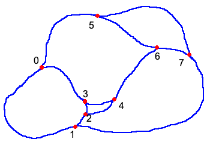

# tsp-momentum
Solving a question from stack overflow (https://stackoverflow.com/questions/71072404/travelling-salesman-with-momentum/71073168#71073168).

Here's the node numbers that I use:

The solution is 

3 -> 0 -> 1 -> 7 -> 5 -> 0 -> 1 -> 2 -> 4 -> 6 -> 7 -> 6 -> 4 -> 3 -> ...

Note that I had to add one non-smooth edge
